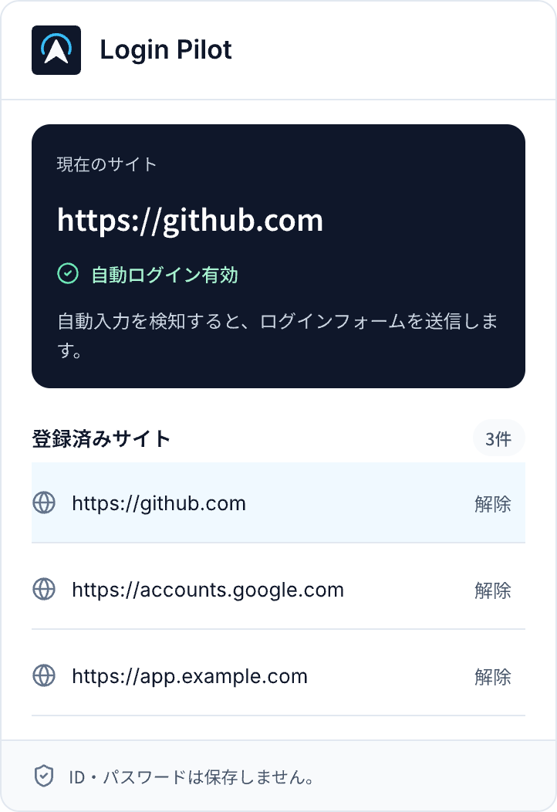

# Login Pilot

Googleパスワードマネージャーによるログインフォームの自動入力を検知し、登録済みサイトでログインフォームを自動送信するChrome拡張機能です。

## 使い方

Chromeウェブストアでの公開は準備中です。現在はソースからビルドして利用できます。

1. Node.js 24.15.0とnpmを用意し、このリポジトリをcloneします。nvmを利用している場合は`nvm install && nvm use`で`.nvmrc`のバージョンを選べます。
2. `npm ci`、`npm run build`を実行します。
3. Chromeで`chrome://extensions`を開き、「デベロッパーモード」を有効にして、「パッケージ化されていない拡張機能を読み込む」から`.output/chrome-mv3`を選びます。
4. Googleパスワードマネージャーにログイン情報を保存したサイトのログインページを開きます。
5. 自動入力を検知すると通知とポップアップに登録候補が表示されます。拡張機能アイコンを押し、対象のoriginを確認して「登録して自動ログイン」を押します。登録したページで、その時点から自動送信を試みます。
6. クリックなしのログインを設定する場合は、登録したサイトで「クリックなしのログインを設定」を押し、Chromeの確認を承認します。

解除する場合は、ポップアップの登録済みサイト一覧から「解除」を押します。登録はorigin（scheme・host・port）単位で、同じoriginの別のログインページにも適用されます。拡張機能を更新した際は、ログインページを再読み込みしてください。



## 対応条件と制限

- 対象はChromeのHTTP/HTTPSページにある、ユーザー名とパスワードを持つ通常の`form`です。Credential Management APIによる取得はHTTPSまたはlocalhostの安全なコンテキストでのみ試みます。
- `autocomplete="new-password"`を含むフォームと、複数のパスワード欄があるフォームは、新規登録・パスワード変更を誤送信しないため除外します。
- 意図を判別できないフォームでは正確にログインを識別できない場合があります。登録するサイトとフォームは自分で確認してください。
- パスキー、二段階認証、CAPTCHA、iframe内のフォーム、Shadow DOM、`form`を使わない画面、IDとパスワードが別画面にあるログインは対応対象外です。追加の認証はサイトの案内に従って操作してください。
- 手入力を開始したフォームは自動送信しません。複数の保存済みアカウント、ブラウザの認証要求、サイト側の実装によって、クリックなしの取得ができない場合があります。
- 自動送信を試みたことと、ログインが成功したことは別です。成功・失敗は対象サイトで確認してください。

## 権限とデータ

| 権限・アクセス | 用途 |
| --- | --- |
| HTTP/HTTPSの全サイトへのcontent script適用 | 未登録サイトを含め、ログインフォームと自動入力の候補を検出するため。自動送信と保存済み認証情報の取得は登録済みoriginに限定します。 |
| `activeTab` | ポップアップを開いたタブのURLを確認するため。 |
| `notifications` | 未登録サイトで自動入力を検知したことを通知するため。 |
| `storage` | 登録originと直近の登録候補を端末内に保存するため。 |

保存するのは登録origin一覧、直近に検出したorigin、検出日時です。ID・パスワードは拡張機能のcontent script内で一時的に扱い、フォームに入力します。拡張機能のストレージ・バックグラウンド・外部サービスには保存・送信しません。フォームの送信により、ログイン情報は対象サイトの送信先に渡ります。

拡張機能には解析・広告・独自サーバーへの通信がありません。公開LPはGoogle Fontsからフォントを読み込みます。詳しくは[プライバシー説明](docs/privacy.md)、脆弱性の報告は[SECURITY.md](SECURITY.md)を参照してください。

## 困ったとき

| 症状 | 確認すること |
| --- | --- |
| 登録候補が表示されない | Googleパスワードマネージャーによる自動入力があるか、通常の`form`とパスワード欄があるかを確認し、ページを再読み込みする。検知にはブラウザの制約があり、ページ操作で自動入力が確定する場合があります。 |
| クリックなしの取得ができない | 保存済みアカウントが1件か、HTTPSか、Chromeの「自動的にログイン」が有効かを確認する。取得できない場合は通常の自動入力を使います。 |
| 入力されたが送信されない | 手入力を始めていないか、複数のパスワード欄・追加認証・無効な送信ボタンがないかを確認する。サイト側の制約がある場合は手動でログインする。 |
| 拡張機能の更新後に動かない | `chrome://extensions`から拡張機能を再読み込みし、ログインページも再読み込みする。 |

不具合を報告する場合は、認証情報や個人情報を削除して[Issue](https://github.com/EkeMinusYou/loginpilot/issues/new/choose)を作成してください。

## 使用技術

- WXT 0.21
- TypeScript
- Chrome Extensions Manifest V3
- Tailwind CSS 4
- Vite

## 開発

```sh
npm ci
npm run dev
```

生成された`.output/chrome-mv3`をChromeの「パッケージ化されていない拡張機能を読み込む」から読み込んでください。

## 検証

```sh
npm test
npm run typecheck
npm run build
npm run lp:build
npm run audit
```

CIでも同じ検証を行います。依存関係の自動更新・自動マージとリリースについては[保守手順](docs/maintenance.md)、開発への参加については[CONTRIBUTING.md](CONTRIBUTING.md)を参照してください。

## LPの開発とデプロイ

`npm run lp:dev`で`http://127.0.0.1:4173`に起動します。`npm run lp:build`で`.output/lp`へ出力し、`npm run lp:preview`でビルド結果を確認できます。Cloudflareへの配備は[デプロイ手順](docs/deployment.md)を参照してください。

## アイコン

Pencilで採用したC案（Pilot）のアイコンです。ネイビーの背景に、白い進路マークと水色の弧を組み合わせています。デザインは`popup-redesign.pen`に保存しています。`public/icon.svg`を元データとし、Chromeのツールバー・拡張機能一覧・通知には`public/icon/`内のPNG（16・32・48・128px）を使用します。

SVGを変更したら、以下のコマンドでPNGを再生成してください。生成したPNGもリポジトリに含めます。

```sh
npm run icons:generate
```

## 動作仕様

- IDやパスワードは拡張機能へ保存・送信しません。
- 登録済みoriginでのみ自動送信します。
- 拡張機能はメールアドレスなどの入力欄へ自動フォーカスせず、ページ側のフォーカスを維持したまま自動入力を監視します。
- Chromeが自動入力を表示していても、ページへの操作があるまで入力値をページへ渡さない場合があります。登録済みサイトではCredential Management APIで保存済み情報を取得し、ページをクリックせずに入力・送信します。デバッグ接続や補助アプリは使用しません。
- 初回は対象のログインページでポップアップの「クリックなしのログインを設定」を押し、Chromeのアカウント確認と自動ログインの確認を承認してください。以降は確認画面を出さない`mediation: 'silent'`で取得します。設定時だけ`mediation: 'optional'`を使います。認証情報はページ内でのみ扱い、拡張機能のバックグラウンドへ送信したり保存したりしません。
- この取得方法はHTTPS（またはlocalhost）のページで、対象サイトに一致する保存済みアカウントが1件あり、Chromeの「自動的にログイン」が有効な場合に利用できます。複数アカウント、デバイス認証の要求、ブラウザ側の拒否などで取得できない場合は、通常の自動入力が確定するのを待ちます。手入力中のフォームは上書きしません。
- 未登録サイトでは自動送信せず、Chrome通知と拡張機能ポップアップから登録を確認します。登録後は現在のページで再評価し、次回以降も自動ログインします。
- Chromeには入力元を完全に識別する公開APIがないため、自動入力状態の検知はフォームの値、入力イベント、autofill擬似クラスを組み合わせて行います。

## ライセンス

本プロジェクト独自のコード・アイコン・デザインは[MIT License](LICENSE)で公開しています。第三者のアイコン・フォントの利用条件は[THIRD_PARTY_NOTICES.md](THIRD_PARTY_NOTICES.md)を参照してください。`package.json`の`private: true`はnpmへの誤公開を防ぐ設定です。
